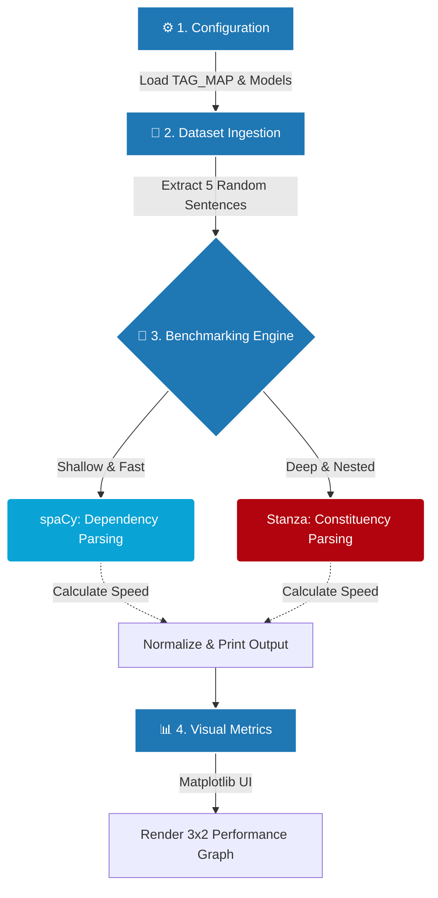

# 🧠 Syntactic Parsing Benchmarker: Dependency vs. Constituency


## 📌 Executive Summary

This repository hosts a high-performance NLP benchmarking tool engineered to evaluate the architectural differences, structural trade-offs, and processing speeds between **Dependency Parsing** and **Constituency Parsing**. 

By natively pulling sample data from real-world `CoNLL-U` linguistic datasets and running them concurrently through modern production pipelines (`spaCy`) and deep-academic pipelines (`Stanford Stanza`), the script provides empirical data outlining the balance between execution speed and hierarchical depth.

---

## 📖How It Works (Architecture Flowchart)



---

## 🎯 Key Capabilities

- **Unbiased Comparative Benchmarking:** Ingests the `UD_English-EWT` dataset natively, randomizing sentence sampling to ensure unbiased speed tests.
- **Output Normalization:** Flattens Stanza's deeply nested, algorithmic constituency NLTK-trees into a normalized, 3-column read format to allow for direct 1-to-1 visual comparison with spaCy’s planar maps.
- **Acronym Translation:** Utilizes a custom structural `TAG_MAP` to automatically translate rigid linguistic taxonomy (e.g., `VP`, `SBAR`) into plain English.
- **Empirical Visualizations:** Features a dynamic Matplotlib visualization integration that automatically generates a 3x2 graphing sequence to cleanly visualize processing speeds and calculate the cost of latency vs. structural accuracy.

---

## 🔬 Architectural Comparison

### 🔹 Dependency Parsing (Powered by `spaCy`)
Dependency parsing strictly models grammatical relationships linearly, assigning "head-word" relationships. 
* **Profile:** Lightweight, shallow structure.
* **Advantage:** Production-grade execution speed.
* **Use Cases:** Search indexing, live user-input validation, chatbot entity extraction.

### 🔹 Constituency Parsing (Powered by `Stanza`)
Constituency parsing focuses on deep morphological derivation, analyzing how smaller word clusters nest recursively inside larger phrase hierarchies (like Russian nesting dolls).
* **Profile:** Deep, highly nested tree structures.
* **Advantage:** Maximum structural context and linguistic modeling.
* **Use Cases:** Automated grammar checking, academic translation mapping, semantic syntax analysis.

---

## 📂 Project Structure

```text
NLP-Parsing-Comparison/
├── UD_English-EWT/         # Core CoNLL-U syntactic dataset containing test sentences
├── venv/                   # Isolated Python virtual environment
├── parser_compare.py       # Main parser evaluation engine
├── Code_Walkthrough.md     # Step-by-step academic presentation guide
└── README.md               # Overview and execution documentation
```

---

## 🚀 Installation & Execution Guide (A-Z)

Follow these steps to fully configure and run the engine from scratch.

### 1️⃣ Virtual Environment and Dependencies
Because AI modules (`spaCy` and `Stanza`) are computationally heavy and have strict dependencies, they must run inside the virtual repository.

```bash
# Windows
venv\Scripts\activate

# Linux / Mac
source venv/bin/activate
```

*Required pip packages if setting up on a fresh machine:*
`pip install spacy stanza matplotlib`
`python -m spacy download en_core_web_sm`

### 2️⃣ Run Benchmarker
Execute the core Python engine. The script will automatically load the NLP models, parse the linguistic dataset, benchmark the performance, output textual mapping logs to the terminal, and physically render the visualization UI.

```bash
python parser_compare.py
```

---

## 📊 Evaluation Output

The system's terminal output structurally maps the parsing differences intuitively for academic review:

```text
--- Dependency Parsing (spaCy) ---
Word         -> Dependency   -> Head Word
-----------------------------------------
fox          -> nsubj        -> jumps

--- Constituency Parsing (Stanza) ---
Word         -> Classification -> Parent Phrase
-----------------------------------------
fox          -> Noun           -> Noun Phrase
```
> *Additionally, executing the engine launches a comprehensive `Matplotlib` graphical UI showcasing execution times per sentence and macro-aggregates.*

---

## 👨‍💻 Author

**Abdul Sami**  
*Developed as part of a comprehensive NLP academic evaluation targeting the architectural limitations and performance capabilities of modern syntactic parsing techniques.*
